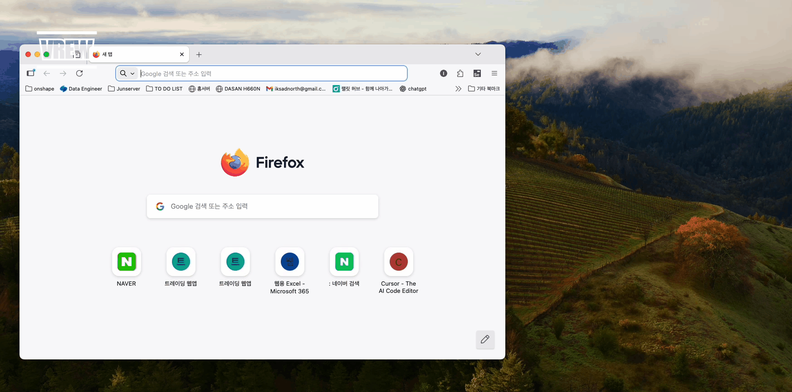
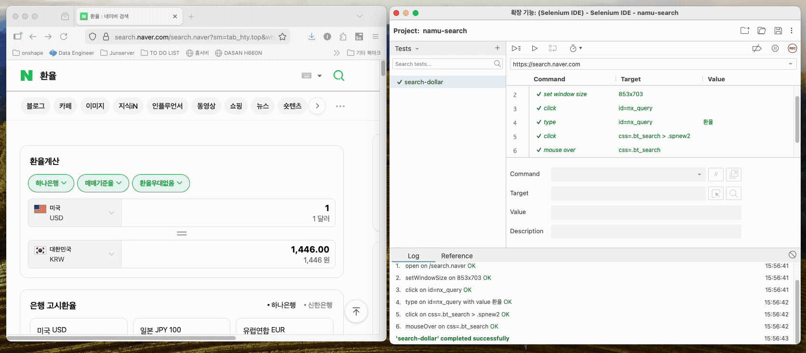
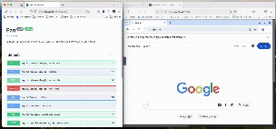

# Pan

**Pan**은 그리스 신화의 양치기 신으로, 양들을 목장에 풀어놓고 풀을 뜯어먹게 하며 양털을 취하는 것처럼, 이 프로젝트는 Selenium IDE가 내보내는 `.side` 파일을 Selenium WebDriver로 실행하여 HTML이라는 풀을 뜯어먹고 데이터라는 양털을 취하는 FastAPI 기반 웹 서버입니다.


*그림 0: 양치기 소년 그림*

Selenium Grid를 활용한 세션 풀링과 동시성 제어를 통해 안정적이고 효율적인 테스트 실행 환경을 제공합니다.


*그림 1: Pan 시스템 아키텍처 - FastAPI 서버, Selenium Grid, 세션 풀, 저장소의 관계*

## 왜 이런 식으로 만들었나요?

- **크롤링 데이터 수집할 때마다 HTML 구조 분석하는 거 너무 힘들다..**
  - 화면 녹화 매크로 툴을 사용해보자! - [1]
- **웹 프로덕트 테스트를 수기로 하니까 너무 귀찮다. 해야하는 건데 후순위로 밀리게 되네..**
  - 화면 녹화 매크로 툴을 사용해보자! - [2]
- **1개의 페이지를 재귀적으로 크롤링하니까 20분 정도 걸리네. 너무 오래걸린다..**
  - 병렬 분산 처리를 통해 시간 단축을 해보자!
- **데이터 파이프라인에 편입하려면 Airflow 이미지 크기가 비대해진다. 빌드 시간이 너무 오래걸린다..**
  - REST API 웹서버로 만들어서 HTTP 통신으로 단순화해보자!
- **크롤링할 때마다 크롬창을 띄워야 하니 리소스 낭비가 너무 심하다..**
  - 서버 가동 시, 미리 크롬창을 여러 개 띄워놓고 재활용해보자!
- **세션 재활용을 하니까 동시에 하나의 세션을 사용하면 간섭이 일어나네..**
  - 요청당 Lock을 부여해서 트랜잭션을 구현해보자!
- **아니 네이버에 검색하는 시나리오를 키워드마다 녹화해야 하나? 녹화 작업에 시간을 너무 많이 쏟아야 하는데..**
  - Side 파일 자체를 Jinja2 템플릿화해서 1번의 녹화로 N개의 시나리오로 만들어보자!

## 이거 어떻게 사용하는 거에요?

### 시연 영상 1: Selenium IDE로 매크로 Side 파일 생성



*영상 1-1: Selenium IDE를 사용하여 웹 자동화 매크로를 녹화하고 .side 파일로 내보내는 과정*



*영상 1-2: .side 파일를 이용한 매크로 실행 [Selenium IDE]*

### 시연 영상 2: Side 파일 등록


*영상 2: Swagger UI를 통해 생성한 .side 파일을 Pan API에 업로드하는 과정*

### 시연 영상 3: noVNC를 통한 세션 모니터링



*영상 3: Selenium Grid Node의 noVNC를 통해 실제 브라우저 세션이 실행되는 모습을 실시간으로 확인*

### 시연 영상 4: 특정 세션에서 Side 파일 실행


*영상 4: 등록된 Side 파일을 특정 세션에서 실행하고 결과를 확인하는 과정*

### 시연 영상 5: 템플릿 파라미터를 활용한 동적 시나리오 실행


*영상 5: Jinja2 템플릿이 포함된 Side 파일에 다양한 파라미터를 전달하여 동적으로 시나리오를 생성하고 실행하는 과정*

## 그래서 의도한 대로 성과가 나왔나요?

1. **QA 시나리오 실행 속도 최적화**
    - **순차 실행 vs 병렬 실행**: 전자 작업(약 ??초)을 후자 작업(약 ??초)로 단축

2. **세션 Pool 확보 최적화**
    - **세션 확보 O vs 세션 확보 X**:  전자 작업(약 ??초)을 후자 작업(약 ??초)로 단축

3. **템플릿 엔진을 통한 파라미터 활용성 극대화**
    - **10개 키워드 검색에 대한 녹화작업 vs 동적 파라미터로 10개 키워드 검색 녹화작업**:  전자 작업(약 ??초)을 후자 작업(약 ??초)로 단축

4. **세션 Pool 초기화 작업의 비동기 처리**
    - **동기적 세션 확보 vs 비동기적 세션 확보**: 동기적 세션 확보 작업(약 2분)을 비동기적 세션 확보 작업(약 5초)로 단축


## 프로젝트 구조

```
src/
├── models.py              # 데이터 모델 (SideProject, SideTest, SideSuite, SideCommand)
├── loader.py              # Side 파일 로딩 및 파싱
├── parser.py              # Jinja2 템플릿 파서
├── runner.py              # 테스트 실행 로직
├── session_pool.py        # Selenium Grid 세션 풀 관리
├── logger_config.py       # 로깅 설정
└── repositories/
    ├── side_repository.py              # Side 파일 저장소 인터페이스
    ├── filesystem_side_repository.py   # FileSystem 기반 side 파일 저장소 구현체
    ├── lock_repository.py              # Lock 관리 인터페이스
    └── filesystem_lock_repository.py   # FileSystem 기반 Lock 관리 구현체
```

## API 문서 확인
- Swagger UI: http://localhost:8000/docs


*그림 7: Swagger UI를 통한 API 테스트 예시*
